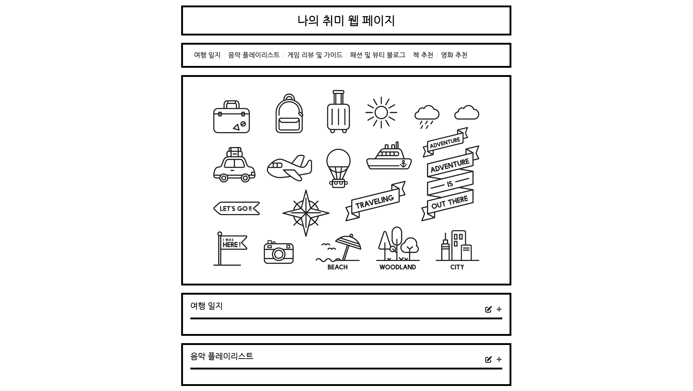

# 나의 취미 웹 페이지 기획서

## 실행 화면

 

## 1. 개요

나의 취미 웹 페이지는 사용자가 다양한 취미 항목을 추가, 읽기, 수정, 삭제(CRUD)할 수 있는 기능을 제공합니다. 이 기획서는 페이지 구조, 기능 및 디자인 요소를 상세히 설명합니다.

## 2. 페이지 구조 및 인터랙션

### 2.1 헤더

- **로고 및 제목**
  - 페이지 상단 중앙에 로고 이미지와 페이지 제목 "나의 취미 웹 페이지"가 위치합니다.
  - 사용자에게 사이트의 목적을 명확히 전달합니다.

### 2.2 네비게이션 바

- **메뉴**
  - 페이지 상단에 고정된 네비게이션 바는 사용자가 페이지 내에서 쉽게 이동할 수 있도록 합니다.
  - 마우스 hover 시 메뉴 텍스트 색상이 변경됩니다.
  - 각 메뉴 항목(여행 일지, 음악 플레이리스트, 게임 리뷰 및 가이드, 패션 및 뷰티 블로그, 책 추천, 영화 추천)은 클릭 시 해당 섹션으로 스크롤 이동합니다.
  - 선택한 메뉴는 active 상태로 유지합니다. (현재 메뉴 표시)
  - 스크롤 이동 및 해당 콘텐츠가 펼침 효과가 적용되도록 합니다. 반대로 펼침 효과를 닫으면 해당 메뉴 또한 active 상태가 해제됩니다.

### 2.3 메인 콘텐츠

- **아이콘 및 텍스트**
  - 여행과 관련된 아이콘들이 페이지 중앙에 배치됩니다.
  - "Let's Go!", "Traveling", "Adventure is out there"와 같은 텍스트가 아이콘 주변에 배치되어 사용자의 흥미를 끌도록 합니다.

### 2.4 세부 섹션

#### 2.4.1 여행 일지

- **목록 보기**

  - 사용자가 작성한 여행 일지 목록이 카드 형태로 표시됩니다.
  - 각 카드에는 여행지 제목, 간략한 설명이 포함됩니다.
  - 상세 보기 페이지는 이번 프로젝트에서 제외합니다.

- **CRUD 인터랙션**
  - **추가/수정 (Create/Update)**
    - "여행 일지" 섹션 제목 오른쪽에 아이콘(연필 모양)을 배치합니다.
    - 아이콘 클릭 시 데이터를 입력할 수 있는 모달 창이 열립니다.
    - 모달 창:
      - 입력 필드: 타이틀, 리스트를 나열할 수 있는 데이터 form 제공
      - 버튼: "저장" 버튼 클릭 시 입력 또는 수정된 내용이 저장되고 목록에 추가되거나 업데이트됩니다.

#### 2.4.2 음악 플레이리스트

- **목록 보기**

  - 음악 플레이리스트 목록이 리스트 형태로 표시됩니다.
  - 각 리스트 아이템에는 곡 제목과 아티스트가 포함됩니다.

- **CRUD 인터랙션**
  - **추가/수정 (Create/Update)**
    - "음악 플레이리스트" 섹션 제목 오른쪽에 아이콘(연필 모양)을 배치합니다.
    - 아이콘 클릭 시 음악 플레이리스트 정보를 입력할 수 있는 모달 창이 열립니다.
    - 모달 창:
      - 입력 필드: 타이틀, 리스트를 나열할 수 있는 데이터 form 제공
      - 버튼: "저장" 버튼 클릭 시 입력 또는 수정된 내용이 저장되고 목록에 추가되거나 업데이트됩니다.

#### 2.4.3 게임 리뷰 및 가이드

- **목록 보기**

  - 게임 리뷰 및 가이드 목록이 리스트 형태로 표시됩니다.
  - 각 리스트 아이템에는 게임 제목과 간략한 설명이 포함됩니다.

- **CRUD 인터랙션**
  - **추가/수정 (Create/Update)**
    - "게임 리뷰 및 가이드" 섹션 제목 오른쪽에 아이콘(연필 모양)을 배치합니다.
    - 아이콘 클릭 시 게임 리뷰 정보를 입력할 수 있는 모달 창이 열립니다.
    - 모달 창:
      - 입력 필드: 타이틀, 리스트를 나열할 수 있는 데이터 form 제공
      - 버튼: "저장" 버튼 클릭 시 입력 또는 수정된 내용이 저장되고 목록에 추가되거나 업데이트됩니다.

#### 2.4.4 패션 및 뷰티 블로그

- **목록 보기**

  - 패션 및 뷰티 정보 목록이 리스트 형태로 표시됩니다.
  - 각 리스트 아이템에는 정보 제목과 간략한 설명이 포함됩니다.

- **CRUD 인터랙션**
  - **추가/수정 (Create/Update)**
    - "패션 및 뷰티 블로그" 섹션 제목 오른쪽에 아이콘(연필 모양)을 배치합니다.
    - 아이콘 클릭 시 패션 및 뷰티 정보를 입력할 수 있는 모달 창이 열립니다.
    - 모달 창:
      - 입력 필드: 타이틀, 리스트를 나열할 수 있는 데이터 form 제공
      - 버튼: "저장" 버튼 클릭 시 입력 또는 수정된 내용이 저장되고 목록에 추가되거나 업데이트됩니다.

#### 2.4.5 책 추천

- **목록 보기**

  - 책 추천 목록이 리스트 형태로 표시됩니다.
  - 각 리스트 아이템에는 책 제목과 간략한 설명이 포함됩니다.

- **CRUD 인터랙션**
  - **추가/수정 (Create/Update)**
    - "책 추천" 섹션 제목 오른쪽에 아이콘(연필 모양)을 배치합니다.
    - 아이콘 클릭 시 책 추천 정보를 입력할 수 있는 모달 창이 열립니다.
    - 모달 창:
      - 입력 필드: 타이틀, 리스트를 나열할 수 있는 데이터 form 제공
      - 버튼: "저장" 버튼 클릭 시 입력 또는 수정된 내용이 저장되고 목록에 추가되거나 업데이트됩니다.

#### 2.4.6 영화 추천

- **목록 보기**

  - 영화 추천 목록이 리스트 형태로 표시됩니다.
  - 각 리스트 아이템에는 영화 제목과 간략한 설명이 포함됩니다.

- **CRUD 인터랙션**
  - **추가/수정 (Create/Update)**
    - "영화 추천" 섹션 제목 오른쪽에 아이콘(연필 모양)을 배치합니다.
    - 아이콘 클릭 시 영화 추천 정보를 입력할 수 있는 모달 창이 열립니다.
    - 모달 창:
      - 입력 필드: 타이틀, 리스트를 나열할 수 있는 데이터 form 제공
      - 버튼: "저장" 버튼 클릭 시 입력 또는 수정된 내용이 저장되고 목록에 추가되거나 업데이트됩니다.

## 3. 디자인 요소

- **아이콘 디자인**

  - 각 CRUD 작업을 위한 아이콘은 명확하고 직관적인 디자인을 가집니다.
  - 연필 아이콘으로 시각적 구분을 줍니다. (입력 가능)

- **모달 창**

  - 추가 및 수정 작업을 위한 입력 폼은 모달 창으로 제공되어, 페이지 전환 없이 작업을 완료할 수 있도록 합니다.

- **카드 및 리스트 아이템**

  - 여행 일지는 카드 형태로, 음악 플레이리스트는 리스트 형태로 제공하여 각 섹션의 특성에 맞는 디자인을 적용합니다.

- **반응형 디자인**
  - 모든 요소는 모바일, 태블릿, 데스크탑 등 다양한 장치에서 최적의 사용자 경험을 제공하도록 반응형으로 디자인됩니다.

## 4. 추가 고려 사항

- **아이콘 배치**

  - 추가 및 수정 기능을 더 직관적으로 만들기 위해 각 섹션의 항목 옆에 아이콘을 배치합니다.

- **반응형 디자인**
  - 모든 요소는 모바일, 태블릿, 데스크탑 등 다양한 장치에서 최적의 사용자 경험을 제공하도록 반응형으로 디자인됩니다.
  - 작은 화면에서도 사용자가 쉽게 접근하고 사용할 수 있도록 인터페이스를 최적화합니다.

## 5. 기능 설명

### 5.1 모달 열기 및 닫기

- **모달 열기**

  - `openModal(title)` 함수는 모달을 열고, 전달된 제목을 모달의 제목으로 설정합니다.
  - 편집 아이콘 클릭 시 호출됩니다.

- **모달 닫기**
  - `closeModal()` 함수는 모달을 닫습니다.
  - 모달 닫기 버튼 및 모달 외부 클릭 시 호출됩니다.

### 5.2 메뉴 렌더링

- `renderMenu()` 함수는 `data` 배열을 순회하여 각 섹션의 메뉴 항목을 생성하고, 이를 메뉴 컨테이너에 추가합니다.

### 5.3 콘텐츠 렌더링

- `renderContent()` 함수는 `data` 배열을 순회하여 각 섹션의 콘텐츠를 동적으로 생성하고, 이를 콘텐츠 컨테이너에 추가합니다.
- 각 섹션은 `div` 요소로 구성되며, 섹션 헤더에는 섹션 제목과 편집 아이콘, 토글 버튼이 포함됩니다.
- 섹션 콘텐츠에는 서브타이틀과 항목 리스트가 포함됩니다.

### 5.4 토글 버튼 설정

- `setupToggle(toggleButtonId, contentId)` 함수는 각 섹션의 토글 버튼을 설정합니다.
- 토글 버튼 클릭 시 섹션 콘텐츠를 펼치거나 접습니다.

### 5.5 초기화

- `initialize()` 함수는 페이지 로드 시 메뉴와 콘텐츠를 렌더링하고, 각 섹션의 토글 버튼을 설정합니다.
- DOMContentLoaded 이벤트 리스너를 사용하여 페이지가 로드된 후 `initialize()` 함수를 호출합니다.

## 6. 향후 개선 사항

- **상세 페이지 추가**

  - 각 항목에 대한 상세 페이지를 추가하여, 더 깊이 있는 정보를 제공할 계획입니다.

- **검색 기능**

  - 사용자가 특정 항목을 빠르게 찾을 수 있도록 검색 기능을 추가할 계획입니다.

이 기획서는 나의 취미 웹 페이지의 기본적인 기능과 디자인 요소를 설명합니다. 향후 개선 사항을 반영하여 지속적으로 발전 시키길 희망합니다.
